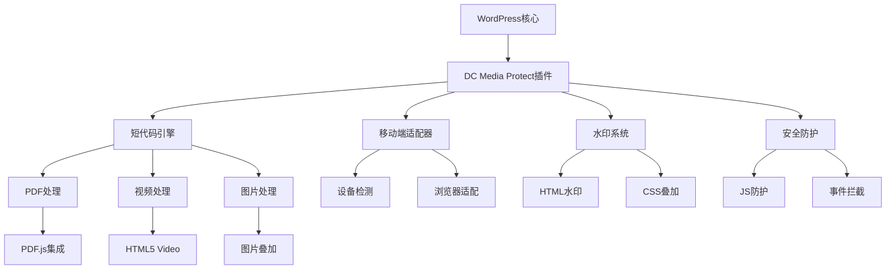

# DC Media Protect 产品需求文档 (PRD)

## 📋 文档信息

| 项目 | 信息 |
|------|------|
| **产品名称** | DC Media Protect |
| **产品类型** | WordPress多媒体保护插件 |
| **文档版本** | v1.0 |
| **创建日期** | 2025年1月 |
| **更新日期** | 2025年1月 |
| **负责人** | 数字中国开发团队 |

---

## 🎯 产品概述

### 1.1 产品定位

DC Media Protect 是一款专为企业级用户设计的WordPress多媒体内容保护插件，旨在为数字中国网站提供全面的文档、视频、图片保护解决方案，防止未授权下载和二次传播。

### 1.2 业务背景

**痛点分析：**
- 数字中国网站前台页面过时，无法动态展示图片效果
- 缺乏视频流播放功能，无法展示公司宣传视频
- 无法安全展示企业PPT文档和机密资料
- 现有方案无法防止多媒体内容被下载和盗用

**解决方案：**
- 提供安全的多媒体内容展示系统
- 集成水印保护和防下载技术
- 支持PDF、视频、图片的统一保护
- 优化移动端和微信环境的显示效果

### 1.3 目标用户

**主要用户群体：**
- **企业管理者**：需要展示机密文档和宣传材料
- **内容创作者**：需要保护原创视频和图片内容
- **网站管理员**：负责网站内容安全和管理
- **终端访客**：在受保护环境下浏览企业内容

---

## 📊 需求分析

### 2.1 功能性需求

#### 2.1.1 核心功能需求

| 功能模块 | 优先级 | 描述 |
|----------|--------|------|
| **PDF文档保护** | P0 | 支持PDF在线预览、水印叠加、防下载 |
| **视频流保护** | P0 | 支持视频播放、水印保护、防下载 |
| **图片保护** | P1 | 自动添加水印、防右键保存 |
| **短代码系统** | P0 | 提供简单易用的短代码接口 |
| **移动端适配** | P1 | 优化微信、QQ浏览器等移动环境 |
| **后台管理** | P1 | 水印设置、安全配置管理界面 |

#### 2.1.2 详细功能规格

**PDF文档保护功能：**
- ✅ 支持PDF在线查看，无需下载
- ✅ 多层水印叠加（文本、时间戳、版权信息）
- ✅ 禁用PDF.js原生下载/打印按钮
- ✅ 自定义全屏查看功能
- ✅ 防止右键下载和复制
- ✅ 支持本地和外部PDF文件
- ✅ 响应式设计，适配不同屏幕尺寸

**视频流保护功能：**
- ✅ HTML5视频播放器集成
- ✅ 动态水印叠加
- ✅ 禁用右键下载
- ✅ 隐藏视频源地址
- ✅ 支持多种视频格式（MP4、WebM等）
- 🔄 支持HLS流媒体格式（未来版本）

**图片保护功能：**
- ✅ 自动添加水印
- ✅ 防止右键保存
- ✅ 拖拽保护
- ✅ 响应式图片显示
- 🔄 服务器端图片水印处理（未来版本）

### 2.2 非功能性需求

#### 2.2.1 性能要求

| 指标 | 目标值 | 说明 |
|------|--------|------|
| **页面加载时间** | < 3秒 | 包含多媒体内容的页面首次加载 |
| **PDF渲染时间** | < 5秒 | 中等大小PDF文档（10-20页） |
| **视频启动时间** | < 2秒 | 视频开始播放的时间 |
| **并发用户数** | 500+ | 同时观看内容的用户数 |
| **文件大小支持** | 最大100MB | 单个PDF或视频文件大小 |

#### 2.2.2 兼容性要求

**浏览器兼容性：**
- ✅ Chrome 80+
- ✅ Firefox 75+
- ✅ Safari 13+
- ✅ Edge 80+
- ✅ 移动端Safari
- ✅ 微信内置浏览器
- ✅ QQ浏览器

**设备兼容性：**
- ✅ PC桌面端
- ✅ 平板设备
- ✅ 智能手机
- ✅ 各种屏幕分辨率

#### 2.2.3 安全要求

| 安全措施 | 实现方式 | 保护级别 |
|----------|----------|----------|
| **客户端保护** | JS禁用右键、快捷键拦截 | 基础 |
| **DOM保护** | HTML叠加层、CSS遮罩 | 中等 |
| **源文件保护** | 隐藏直接链接、Referer验证 | 中等 |
| **水印保护** | 多层水印、动态生成 | 高 |
| **访问控制** | 基于WordPress权限系统 | 高 |

---

## 🏗️ 系统架构

### 3.1 技术架构



### 3.2 核心组件

#### 3.2.1 插件核心 (dc-media-protect.php)
- **职责**：插件初始化、资源加载、钩子注册
- **依赖**：WordPress核心、插件子模块
- **输出**：注册的短代码和前端资源

#### 3.2.2 短代码引擎 (includes/shortcode.php)
- **职责**：处理[dc_ppt]、[dc_video]、[dc_img]短代码
- **输入**：短代码参数（src, width, height等）
- **输出**：受保护的HTML内容和JavaScript

#### 3.2.3 移动端适配器 (includes/mobile-pdf-viewer.php)
- **职责**：针对移动设备和特殊浏览器的适配
- **输入**：设备类型、浏览器信息
- **输出**：优化的显示方案

### 3.3 依赖关系

**必需依赖：**
- WordPress 5.0+
- PHP 7.4+
- PDF.js Viewer Shortcode（修改版）

**可选依赖：**
- HLS视频流插件
- 图片处理库（GD/ImageMagick）

---

## 💻 技术规范

### 4.1 开发规范

#### 4.1.1 编码规范
- **PHP**：遵循WordPress编码标准
- **JavaScript**：ES6+语法，使用现代浏览器特性
- **CSS**：BEM命名规范，响应式设计
- **HTML**：语义化标签，无障碍访问支持

#### 4.1.2 文件组织
```
dc-media-protect/
├── dc-media-protect.php          # 主插件文件
├── includes/                     # 核心功能模块
│   ├── shortcode.php            # 短代码处理
│   ├── mobile-pdf-viewer.php    # 移动端适配
│   ├── admin-pages.php          # 后台管理
│   ├── watermark.php            # 水印系统（预留）
│   ├── upload-handler.php       # 上传处理（预留）
│   ├── ppt-convert.php          # PPT转换（预留）
│   └── content-crawler.php      # 内容爬虫（预留）
├── assets/                      # 前端资源
│   ├── css/
│   │   └── style.css           # 主样式文件
│   └── js/
│       └── frontend.js         # 前端JavaScript
├── templates/                   # 模板文件（预留）
└── languages/                  # 国际化文件（预留）
```

### 4.2 API设计

#### 4.2.1 短代码API

**PDF显示短代码：**
```html
[dc_ppt src="文件路径" width="宽度" height="高度"]
```

**参数说明：**
- `src`：PDF文件路径（必需）
- `width`：显示宽度，默认100%
- `height`：显示高度，默认600px

**视频播放短代码：**
```html
[dc_video src="视频路径" width="宽度" height="高度"]
```

**图片显示短代码：**
```html
[dc_img src="图片路径" width="宽度" height="高度"]
```

#### 4.2.2 配置API

**水印配置：**
```php
// 获取水印文本
$watermark = get_option('dcmp_watermark_text', '数字中国');

// 设置水印文本
update_option('dcmp_watermark_text', '新的水印文本');
```

---

## 🎨 用户体验

### 5.1 用户界面设计

#### 5.1.1 前端显示界面

**PDF查看器界面：**
- 清晰的PDF显示区域
- 集成的全屏按钮（绿色🔳图标）
- 多层水印叠加（不影响阅读）
- 禁用的下载/打印控件

**视频播放器界面：**
- 标准HTML5视频控件
- 水印叠加层
- 禁用的右键菜单
- 响应式播放控制

**图片显示界面：**
- 高质量图片显示
- 水印保护覆盖
- 防拖拽保护
- 响应式布局

#### 5.1.2 后台管理界面

**设置页面：**
- 水印文本配置
- 安全级别设置
- 功能开关控制
- 使用统计查看

### 5.2 用户流程

#### 5.2.1 内容发布流程
1. 管理员上传多媒体文件到WordPress媒体库
2. 在文章/页面编辑器中插入对应短代码
3. 设置显示参数（宽度、高度等）
4. 发布内容，系统自动应用保护措施

#### 5.2.2 内容访问流程
1. 访客打开包含保护内容的页面
2. 系统检测设备和浏览器类型
3. 选择最佳显示方案
4. 应用水印和防护措施
5. 向用户展示受保护的内容

---

## 🔬 测试计划

### 6.1 功能测试

#### 6.1.1 基础功能测试

| 测试项目 | 测试内容 | 预期结果 |
|----------|----------|----------|
| **PDF显示** | 测试各种大小的PDF文件 | 正常显示，水印叠加 |
| **视频播放** | 测试不同格式的视频 | 正常播放，无法下载 |
| **图片保护** | 测试图片显示和保护 | 显示正常，无法保存 |
| **短代码解析** | 测试短代码参数解析 | 参数正确生效 |
| **水印显示** | 测试水印叠加效果 | 水印清晰可见 |

#### 6.1.2 兼容性测试

**浏览器测试矩阵：**
- Chrome各版本测试
- Firefox各版本测试
- Safari桌面和移动版测试
- Edge浏览器测试
- 微信内置浏览器测试
- QQ浏览器测试

**设备测试：**
- Windows PC测试
- Mac电脑测试
- iOS设备测试
- Android设备测试
- 平板设备测试

### 6.2 性能测试

#### 6.2.1 负载测试
- 并发用户访问测试
- 大文件加载性能测试
- 长时间运行稳定性测试

#### 6.2.2 响应时间测试
- PDF加载时间测试
- 视频启动时间测试
- 页面整体响应时间测试

### 6.3 安全测试

#### 6.3.1 防护有效性测试
- 右键菜单禁用测试
- 快捷键拦截测试
- 拖拽保护测试
- 开发者工具对抗测试

#### 6.3.2 绕过尝试测试
- 技术性下载尝试
- 脚本注入测试
- 源文件直接访问测试

---

## 📈 发布计划

### 7.1 版本规划

#### 7.1.1 v1.0（当前版本）
**核心功能：**
- ✅ PDF文档保护和显示
- ✅ 视频播放保护
- ✅ 图片保护显示
- ✅ 基础短代码系统
- ✅ 移动端适配

**发布时间：** 2025年1月

#### 7.1.2 v1.1（规划中）
**增强功能：**
- 🔄 服务器端图片水印处理
- 🔄 HLS视频流支持
- 🔄 PPT自动转换功能
- 🔄 更强的安全防护
- 🔄 性能优化

**预计发布：** 2025年3月

#### 7.1.3 v2.0（远期规划）
**高级功能：**
- 🔄 用户权限控制
- 🔄 内容加密保护
- 🔄 访问日志和统计
- 🔄 API接口开放
- 🔄 多站点支持

**预计发布：** 2025年6月

### 7.2 部署策略

#### 7.2.1 部署环境
- **开发环境**：本地WordPress开发环境
- **测试环境**：与生产环境相同配置的测试服务器
- **生产环境**：数字中国官方网站

#### 7.2.2 部署流程
1. 代码审查和测试完成
2. 打包插件文件
3. 在测试环境验证功能
4. 备份生产环境数据
5. 部署到生产环境
6. 功能验证和监控

---

## 📞 支持与维护

### 8.1 技术支持

#### 8.1.1 文档支持
- 详细的安装文档
- 使用说明和最佳实践
- 常见问题解答
- 架构和开发文档

#### 8.1.2 问题反馈
- GitHub Issues跟踪
- 邮件技术支持
- 在线文档和Wiki

### 8.2 维护计划

#### 8.2.1 定期维护
- 安全更新和补丁
- 性能优化和改进
- 兼容性更新
- 功能增强

#### 8.2.2 监控和分析
- 使用情况统计
- 性能监控
- 错误日志分析
- 用户反馈收集

---

## 📋 附录

### 附录A：技术术语表

| 术语 | 定义 |
|------|------|
| **Shortcode** | WordPress短代码，用于在内容中嵌入动态功能 |
| **PDF.js** | Mozilla开发的JavaScript PDF渲染库 |
| **HLS** | HTTP Live Streaming，苹果开发的流媒体协议 |
| **Iframe** | HTML内联框架元素，用于嵌入其他页面 |
| **DOM** | Document Object Model，文档对象模型 |
| **Canvas** | HTML5画布元素，用于图形渲染 |

### 附录B：相关标准和规范

- WordPress Plugin Development Standards
- HTML5 Video API Specification
- PDF.js API Documentation
- Web Content Accessibility Guidelines (WCAG)

### 附录C：第三方依赖

| 依赖项 | 版本 | 许可证 | 用途 |
|--------|------|--------|------|
| WordPress | 5.0+ | GPL v2+ | 核心平台 |
| PDF.js | 自定义修改版 | Apache 2.0 | PDF渲染 |
| HTML5 Video | 原生支持 | W3C标准 | 视频播放 |

---

**文档结束**

> 📄 本文档为DC Media Protect插件的完整产品需求文档，涵盖了产品设计、技术实现、测试计划和发布策略的所有方面。如有疑问或需要更新，请联系开发团队。 